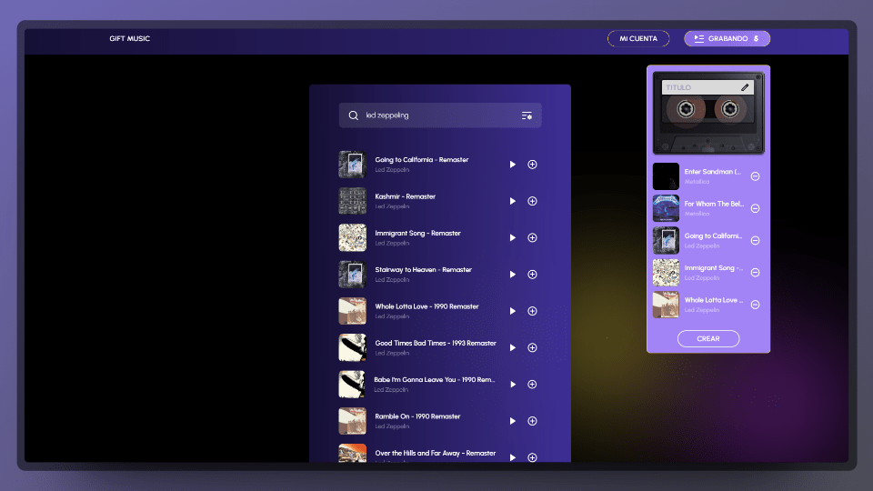

# Aplicación PlaylistParty

PlaylistParty es una aplicación que te permite explorar y compartir tus canciones favoritas, crear listas de reproducción personalizadas y enviar dedicatorias a tus amigos. La aplicación se integra con la API de Spotify para buscar canciones, obtener detalles de artistas y gestionar listas de reproducción.

## Características

- **Registro de Usuarios:** Permite a los usuarios registrarse con su correo, nombre y contraseña.
- **Inicio de Sesión:** Proporciona una página para iniciar sesión con credenciales de correo y contraseña.
- **Búsqueda de Canciones:** Permite a los usuarios buscar canciones por nombre y artista.

## Instalación

1. Clona el repositorio: `git clone https://github.com/tu-usuario/playlist-party-app.git`
2. Ingresa al directorio: `cd playlist-party-app`
3. Instala las dependencias: `npm install`
4. Inicia la aplicación: `npm start`

## Uso

Una vez que la aplicación esté en funcionamiento, puedes:

- Registrarte con un correo, nombre y contraseña.
- Iniciar sesión con tus credenciales.
- Buscar canciones y artistas.
- Ver detalles de canciones y artistas.
- Escuchar canciones en Spotify.
- Agregar canciones a tus listas de reproducción.
- Crear, editar y eliminar listas de reproducción.
- Compartir listas de reproducción con amigos.

## Rutas

### `/register`

- Página pública para registrarse con correo, nombre y contraseña.

### `/login`

- Página pública para iniciar sesión con correo y contraseña.

### `/`

- Página protegida para buscar canciones, ver detalles y agregar a listas de reproducción.

### `/tracks/:id`

- Página protegida para ver detalles de una canción y recomendaciones.

### `/artists/:id`

- Página protegida para ver detalles de un artista y canciones principales.

### `/playlists`

- Página protegida para ver todas las listas de reproducción del usuario y editarlas.

### `/playlists/:id`

- Página protegida para editar una lista de reproducción específica.

### `/playlists/public/:id`

- Página pública para ver detalles de una lista de reproducción compartida.

## Colaboradores

Este proyecto ha sido posible gracias a la contribución de:

- [Jesús Aguilar](https://github.com/JesusAguilarAliaga)
- [Dergi Samayoa](https://github.com/DergiSamayoa)
- [Cristiano Sime](https://github.com/SimeneitorT1000)

¡Agradecemos a todos por su valioso trabajo!

## Librerías Utilizadas

- [React](https://reactjs.org/)
- [React Router](https://reactrouter.com/)
- [Redux Toolkit](https://redux-toolkit.js.org/)
- [Axios](https://axios-http.com/)
- [Styled Components](https://styled-components.com/)

## Contribuciones

¡Contribuciones son bienvenidas! Si deseas mejorar este proyecto, siéntete libre de crear un Pull Request.

## Licencia

Este proyecto está bajo la licencia MIT. Consulta el archivo `LICENSE` para más detalles.
